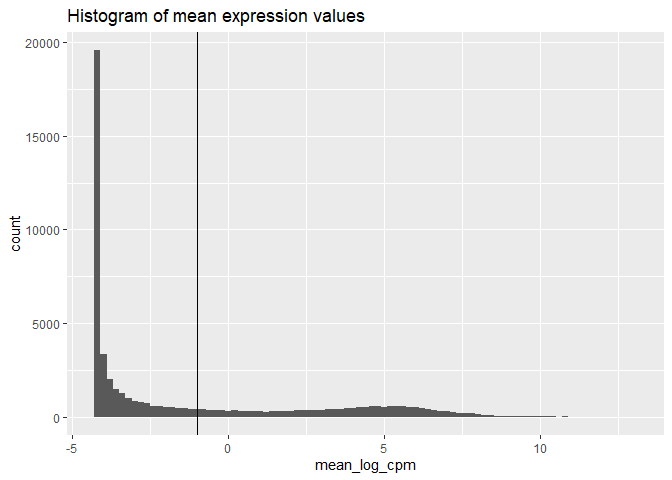

## Introduction

In this workflow, differential gene expression analysis will be
performed on host-transcriptomics data.

## R environment setup

First, install all required packages.

``` r
# check if BioCmanager libraries are already installed > otherwise install it
if(!requireNamespace("BiocManager", quietly = TRUE)) install.packages("BiocManager",repos = "http://cran.us.r-project.org")
if(!"rstudioapi" %in% installed.packages()) BiocManager::install("rstudioapi")
if(!"baySeq" %in% installed.packages()) BiocManager::install("baySeq")
if(!"DESeq2" %in% installed.packages()) BiocManager::install("DESeq2")
if(!"edgeR" %in% installed.packages()) BiocManager::install("edgeR")
if(!"bioDist" %in% installed.packages()) BiocManager::install("bioDist")
if(!"biomaRt" %in% installed.packages()) BiocManager::install("biomaRt")
if(!"dplyr" %in% installed.packages()) BiocManager::install("dplyr")
if(!"magrittr" %in% installed.packages()) BiocManager::install("magrittr")
if(!"EnhancedVolcano" %in% installed.packages()) BiocManager::install("EnhancedVolcano")

#Regular R packages:
if(!"ggplot2" %in% installed.packages()){install.packages("ggplot2")}
if(!"limma" %in% installed.packages()){install.packages("limma")}
#if(!"R2HTML" %in% installed.packages()){install.packages("R2HTML")}

#load packages
library(rstudioapi)
library(baySeq)
library(DESeq2)
library(edgeR)
library(bioDist)
library(biomaRt)
library(dplyr)
library(magrittr)
library(EnhancedVolcano)
library(ggplot2)
library(limma)
#library(R2HTML)

# set working environment to the location where current source file is saved into.
setwd(dirname(rstudioapi::getSourceEditorContext()$path))
#include some functions adapted from ArrayAnalysis.org scripts
source("functions_ArrayAnalysis_v2.R")
WORK.DIR <- getwd()
```

## Data Preparations

The following section will prepare the input data to be used in the
analysis

``` r
#set wd one directory below to reach the input data
setwd('..')
WORK.DIR <- getwd()

#Obtain data from step 1
htxCount <- read.csv("1-data_preprocessing/output/htxCount.csv")
sampleLabels <- read.csv("1-data_preprocessing/output/sampleLabels.csv", header=FALSE)

# Set Working Directory back to current folder
setwd(dirname(rstudioapi::getSourceEditorContext()$path))
WORK.DIR<- getwd()

#checking which samples have all zero values across all genes
#these sample should be removed otherwise there will be a problem when calculating estimate size factors
idx <- which(colSums(htxCount) == 0)
#CSMDRVXI MSM719ME  are samples which has all zero values for all genes, so we remove them
htxCount <- htxCount[ , -idx]

#removing same samples from sample labels metadata
sampleLabels <- sampleLabels[-idx , ]
#Set column one as rownames
rownames(sampleLabels) <- sampleLabels[,1]
sampleLabels <- sampleLabels[,-1]
#add column names 
colnames(sampleLabels) <- c( "sampleID", "biopsy_location","disease")
#check whether sample names are in same order
#all(colnames(htxCount) == rownames(sampleLabels2))

#select only biopsy_location and disease columns
sampleLabels<-sampleLabels[, c(2,3)]
sampleLabels$disease <- relevel(factor(sampleLabels$disease),ref="nonIBD")
#add an experimental group variable to sampleLabels
sampleLabels$group <- as.factor(paste(sampleLabels$disease,sampleLabels$biopsy_location,sep="_"))
```

## Filtering Steps

We will apply some filtering process to filter out genes in the input
data

``` r
#remove genes which have all zero values across all samples then start DE analysis
nonzero <- rowSums(htxCount) > 0
htxCount %<>% .[nonzero,]

#############################CPM FILTERING#############################################
#aveLogCPM function computes average log2 counts-per-million for each row of counts.
#the below function is similar to log2(rowMeans(cpm(y, ...)))
mean_log_cpm = aveLogCPM(htxCount)

# We plot the distribution of average log2 CPM values to verify that our chosen presence threshold is appropriate. The distribution is expected to be bi modal, with a low-abundance peak representing non-expressed genes and a high-abundance peak representing expressed genes. The chosen threshold should separate the two peaks of the bi modal distribution. 
filter_threshold <- -1# we can try different threshold values
#jpeg(file="avgLogCpmDist.jpeg")#if you want to save the histogram uncomment the following command  
ggplot() + aes(x=mean_log_cpm) +
    geom_histogram(binwidth=0.2) +
    geom_vline(xintercept=filter_threshold) +
    ggtitle("Histogram of mean expression values")
```



``` r
#dev.off()#to save the plot to the file
#Having chosen our threshold, lets pick the subset of genes whose average expression passes that threshold.
keep_genes <- mean_log_cpm >= filter_threshold 
htxCount <- htxCount[keep_genes,]
#dim(htxCount)#to check dimension of the data
###############################################################################
```

## Differential Gene Expression Analysis

In the following section differential gene expression analysis will be
performed using DESeq2 package

``` r
# First create a DESeqDataSet object
#(non-intercept) statistical model based on the disease and biopsy_location, group column represent both of them 
dds <- DESeqDataSetFromMatrix(countData = htxCount, colData=sampleLabels, design= ~0 + group)

#estimate the size factors
#To perform the median of ratios method of normalization, DESeq2 has a single estimateSizeFactors() function that will generate size factors for us.
dds <- estimateSizeFactors(dds)
#normalize the data (here for Quality Control(QC) plotting)
#QC plotting is optional
norm <- counts(dds,normalize=TRUE)
#create a 2logged data for original object (here for QC plotting)
datlog <- log(htxCount+1,2)
#create a 2logged norm object (here for QC plotting)
normlog <- log(norm+1,2)
#for QC remove genes that have not been measured in any sample in the experiment
datlogQC <- datlog[rowSums(datlog)!=0,]
normlogQC <- normlog[rowSums(normlog)!=0,]
#create QC plots for raw data, colored by different variables
factors <- c("disease","biopsy_location","group")
if(!dir.exists("QCraw")) dir.create("QCraw")
setwd(paste(WORK.DIR,"QCraw",sep="/"))
png("sizefactors.png")
plot(sizeFactors(dds),type='h',lwd=5,ylim=c(0,max(sizeFactors(dds))),col="darkblue")
dev.off()
```

    ## png 
    ##   2

``` r
createQCPlots(datlogQC, factors, Table=sampleLabels, normMeth="", postfix="")
setwd("..")
#create QC plots for normalized data coloured by different variables
if(!dir.exists("QCnorm")) dir.create("QCnorm")
setwd(paste(WORK.DIR,"QCnorm",sep="/"))
createQCPlots(normlogQC, factors, Table=sampleLabels, normMeth="DESeq", postfix="")
setwd("..")
#sample MSM719M9 is an outlier remove it from dataset
#sample HSM5FZAZ is an outlier remove it from dataset
htxCount <- htxCount[,-match(c("MSM719M9","HSM5FZAZ"),colnames(htxCount))]
sampleLabels <- sampleLabels[-match(c("MSM719M9","HSM5FZAZ"),rownames(sampleLabels)),]
#doublecheck whether the order of the samples in sampleLabels and htxCount data still match
#sum(rownames(sampleLabels) == colnames(htxCount))==dim(sampleLabels)[1]

###REDO ALL STEPS AS ABOVE FOR FILTERED OUT DATASET
dds <- DESeqDataSetFromMatrix(countData = htxCount, colData=DataFrame(sampleLabels), design= ~0 + group)
dds <- estimateSizeFactors(dds)
norm <- counts(dds,normalize=TRUE)
datlog <- log(htxCount+1,2)
normlog <- log(norm+1,2)
datlogQC <- datlog[rowSums(datlog)!=0,]
normlogQC <- normlog[rowSums(normlog)!=0,]
#create QC plots for raw data, coloured by different variables
if(!dir.exists("QCraw2")) dir.create("QCraw2")
setwd(paste(WORK.DIR,"QCraw2",sep="/"))
png("sizefactors2.png")
plot(sizeFactors(dds),type='h',lwd=5,ylim=c(0,max(sizeFactors(dds))),col="darkblue")
dev.off()
```

    ## png 
    ##   2

``` r
createQCPlots(datlogQC, factors, Table=sampleLabels, normMeth="", postfix="")
setwd("..")
#create QC plots for normalized data coloured by different variables
if(!dir.exists("QCnorm2")) dir.create("QCnorm2")
setwd(paste(WORK.DIR,"QCnorm2",sep="/"))
createQCPlots(normlogQC, factors, Table=sampleLabels, normMeth="DESeq", postfix="")
setwd("..")

################################################################################
#######################statistical modelling####################################
################################################################################
#set directory for stat output
if(!dir.exists("statsmodel")) dir.create("statsmodel")
setwd(paste(WORK.DIR,"statsmodel",sep="/"))
#run differential analysis
dds <- DESeq(dds)
#results(dds) #runs the default DESeq2 comparison    (last factor level versus first factor level)
cont.matrix <- makeContrasts(
  #CD disease on ileum and rectum 
  CD_Ileum_vs_nonIBD_Ileum   = groupCD_Ileum - groupnonIBD_Ileum,
  CD_Rectum_vs_nonIBD_Rectum = groupCD_Rectum - groupnonIBD_Rectum,
  #UC disease on ileum and rectum
  UC_Ileum_vs_nonIBD_Ileum   = groupUC_Ileum - groupnonIBD_Ileum,
  UC_Rectum_vs_nonIBD_Rectum = groupUC_Rectum - groupnonIBD_Rectum,
  #UC and CD disease comparison
  UC_Ileum_vs_CD_Illeum     = groupUC_Ileum - groupCD_Ileum,
  UC_Rectum_vs_CD_Rectum    = groupUC_Rectum - groupCD_Rectum,
  #biopsy location comparisons
  CD_Rectum_vs_CD_Ileum     = (groupCD_Rectum - groupnonIBD_Rectum) - (groupCD_Ileum - groupnonIBD_Ileum),
  UC_Rectum_vs_UC_Ileum     = (groupUC_Rectum - groupnonIBD_Rectum) - (groupUC_Ileum - groupnonIBD_Ileum),
  levels = resultsNames(dds)
)
#extract resulting contrasts based on the model, and save those in a table; also save some graphical representations
#the function results() is called from within the saveStatOutputDESeq2 function to compute the contrasts
files <- saveStatOutputDESeq2(cont.matrix,dds,postfix="",annotation=NULL)
```

    ## --[[ Saving table for coefficient    CD_Ileum_vs_nonIBD_Ileum     ]]--
    ## ----[[  0  probes with NA estimates removed ]]

    ## --[[ Saving table for coefficient    CD_Rectum_vs_nonIBD_Rectum   ]]--
    ## ----[[  0  probes with NA estimates removed ]]

    ## --[[ Saving table for coefficient    UC_Ileum_vs_nonIBD_Ileum     ]]--
    ## ----[[  0  probes with NA estimates removed ]]

    ## --[[ Saving table for coefficient    UC_Rectum_vs_nonIBD_Rectum   ]]--
    ## ----[[  0  probes with NA estimates removed ]]

    ## --[[ Saving table for coefficient    UC_Ileum_vs_CD_Illeum    ]]--
    ## ----[[  0  probes with NA estimates removed ]]

    ## --[[ Saving table for coefficient    UC_Rectum_vs_CD_Rectum   ]]--
    ## ----[[  0  probes with NA estimates removed ]]

    ## --[[ Saving table for coefficient    CD_Rectum_vs_CD_Ileum    ]]--
    ## ----[[  0  probes with NA estimates removed ]]

    ## --[[ Saving table for coefficient    UC_Rectum_vs_UC_Ileum    ]]--
    ## ----[[  0  probes with NA estimates removed ]]

``` r
#create summary table of the contrast results
#up and down for p-val and adj p-val are decided by log2FC>=0.58 and  log2FC<0.58
createPvalTab(files,postfix="",namePVal="pvalue",nameAdjPVal="padj",nameFC="FoldChange",nameLogFC="log2FoldChange",html=TRUE)
```

    ## --[[ Saving Summary_tables.tab ]]--
    ## --[[ Saving Summary_tables.html ]]--

``` r
setwd("..")
```

## Enhanced Volcano Plots Visualization

Differential gene expression analysis results is visualized by volcano
plots

``` r
#set the wd to the result folder statsmodel
setwd(paste(WORK.DIR,"statsmodel",sep="/"))
readFilePath <- paste(WORK.DIR,"statsmodel",sep="/")
# create an empty list
plot_list = list()
for(i in 1:length(files))
{
  #read file
  splitted <- strsplit(files[i], split = "_")[[1]]
  title <- splitted [2:6]
  title <- paste (splitted[2],splitted[3],splitted[4],splitted[5],splitted[6],sep=" ") 
  title <- (strsplit(title, split = "\\.")[[1]])[1]
  tab <- read.delim(paste(readFilePath, files[i],sep="/"),header=TRUE,as.is=TRUE)  
  p<-EnhancedVolcano(tab , lab = tab$X, labSize = 3, title = title, 
                     x = 'log2FoldChange', y = 'pvalue', pCutoff = 0.05, FCcutoff = 0.58)
  plot_list[[i]] = p
}
#path of the output folder
outFolder <- paste(WORK.DIR,"volcano_plots",sep="/")
#create folder if doesnt exist
if(!dir.exists(outFolder)) dir.create(outFolder)

for(i in 1:length(files)) {
    file_name = paste(outFolder,"/",files[i],".png",sep="")
    png(file_name)
    print(plot_list[[i]])
    dev.off()
}  
```

##Print session info and remove large datasets:

``` r
##Print session info:
sessionInfo()
```

    ## R version 4.2.0 (2022-04-22)
    ## Platform: x86_64-pc-linux-gnu (64-bit)
    ## Running under: Ubuntu 18.04.6 LTS
    ## 
    ## Matrix products: default
    ## BLAS:   /usr/lib/x86_64-linux-gnu/blas/libblas.so.3.7.1
    ## LAPACK: /usr/lib/x86_64-linux-gnu/lapack/liblapack.so.3.7.1
    ## 
    ## locale:
    ##  [1] LC_CTYPE=en_US.UTF-8       LC_NUMERIC=C              
    ##  [3] LC_TIME=nl_NL.UTF-8        LC_COLLATE=en_US.UTF-8    
    ##  [5] LC_MONETARY=nl_NL.UTF-8    LC_MESSAGES=en_US.UTF-8   
    ##  [7] LC_PAPER=nl_NL.UTF-8       LC_NAME=C                 
    ##  [9] LC_ADDRESS=C               LC_TELEPHONE=C            
    ## [11] LC_MEASUREMENT=nl_NL.UTF-8 LC_IDENTIFICATION=C       
    ## 
    ## attached base packages:
    ## [1] parallel  stats4    stats     graphics  grDevices utils     datasets 
    ## [8] methods   base     
    ## 
    ## other attached packages:
    ##  [1] R2HTML_2.3.2                gplots_3.1.3               
    ##  [3] EnhancedVolcano_1.14.0      ggrepel_0.9.1              
    ##  [5] ggplot2_3.3.6               magrittr_2.0.3             
    ##  [7] dplyr_1.0.9                 biomaRt_2.52.0             
    ##  [9] bioDist_1.68.0              KernSmooth_2.23-20         
    ## [11] edgeR_3.38.0                limma_3.52.0               
    ## [13] DESeq2_1.36.0               SummarizedExperiment_1.26.1
    ## [15] Biobase_2.56.0              MatrixGenerics_1.8.0       
    ## [17] matrixStats_0.62.0          baySeq_2.30.0              
    ## [19] abind_1.4-5                 GenomicRanges_1.48.0       
    ## [21] GenomeInfoDb_1.32.2         IRanges_2.30.0             
    ## [23] S4Vectors_0.34.0            BiocGenerics_0.42.0        
    ## [25] rstudioapi_0.13            
    ## 
    ## loaded via a namespace (and not attached):
    ##  [1] bitops_1.0-7           bit64_4.0.5            filelock_1.0.2        
    ##  [4] RColorBrewer_1.1-3     progress_1.2.2         httr_1.4.3            
    ##  [7] tools_4.2.0            utf8_1.2.2             R6_2.5.1              
    ## [10] DBI_1.1.2              colorspace_2.0-3       withr_2.5.0           
    ## [13] tidyselect_1.1.2       prettyunits_1.1.1      curl_4.3.2            
    ## [16] bit_4.0.4              compiler_4.2.0         cli_3.3.0             
    ## [19] xml2_1.3.3             DelayedArray_0.22.0    labeling_0.4.2        
    ## [22] caTools_1.18.2         scales_1.2.0           genefilter_1.78.0     
    ## [25] rappdirs_0.3.3         stringr_1.4.0          digest_0.6.29         
    ## [28] rmarkdown_2.14         XVector_0.36.0         pkgconfig_2.0.3       
    ## [31] htmltools_0.5.2        highr_0.9              dbplyr_2.1.1          
    ## [34] fastmap_1.1.0          rlang_1.0.2            RSQLite_2.2.13        
    ## [37] farver_2.1.0           generics_0.1.2         gtools_3.9.2          
    ## [40] BiocParallel_1.30.0    RCurl_1.98-1.6         GenomeInfoDbData_1.2.8
    ## [43] Matrix_1.4-1           Rcpp_1.0.8.3           munsell_0.5.0         
    ## [46] fansi_1.0.3            lifecycle_1.0.1        stringi_1.7.6         
    ## [49] yaml_2.3.5             zlibbioc_1.42.0        BiocFileCache_2.4.0   
    ## [52] grid_4.2.0             blob_1.2.3             crayon_1.5.1          
    ## [55] lattice_0.20-45        Biostrings_2.64.0      splines_4.2.0         
    ## [58] annotate_1.74.0        hms_1.1.1              KEGGREST_1.36.0       
    ## [61] locfit_1.5-9.5         knitr_1.39             pillar_1.7.0          
    ## [64] geneplotter_1.74.0     XML_3.99-0.9           glue_1.6.2            
    ## [67] evaluate_0.15          BiocManager_1.30.17    png_0.1-7             
    ## [70] vctrs_0.4.1            gtable_0.3.0           purrr_0.3.4           
    ## [73] assertthat_0.2.1       cachem_1.0.6           xfun_0.31             
    ## [76] xtable_1.8-4           survival_3.3-1         tibble_3.1.7          
    ## [79] AnnotationDbi_1.58.0   memoise_2.0.1          ellipsis_0.3.2

``` r
##Remove data objects which are not needed for further processing:
rm(list=setdiff(ls(), "tab"))
```

### Last, we create a Jupyter notebook from this script

``` r
#Jupyter Notebook file
if(!"devtools" %in% installed.packages()) BiocManager::install("devtools")
devtools::install_github("mkearney/rmd2jupyter", force=TRUE)
```

    ## 
    ## * checking for file ‘/tmp/RtmpLN4cki/remotes5cf47a1507d/mkearney-rmd2jupyter-d2bd2aa/DESCRIPTION’ ... OK
    ## * preparing ‘rmd2jupyter’:
    ## * checking DESCRIPTION meta-information ... OK
    ## * checking for LF line-endings in source and make files and shell scripts
    ## * checking for empty or unneeded directories
    ## Omitted ‘LazyData’ from DESCRIPTION
    ## * building ‘rmd2jupyter_0.1.0.tar.gz’

``` r
library(devtools)
library(rmd2jupyter)
setwd(dirname(rstudioapi::getSourceEditorContext()$path))
rmd2jupyter("DEanalysis.Rmd")
```
