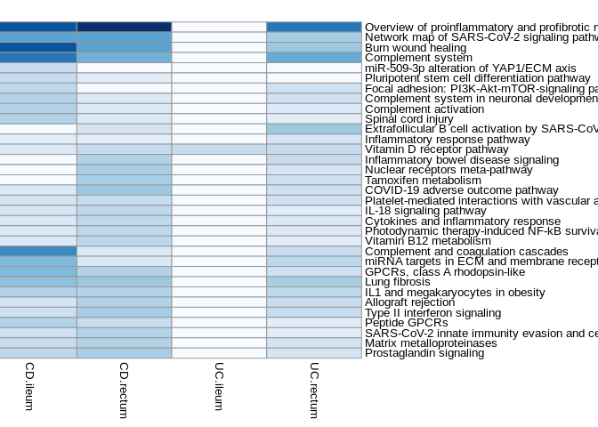

## Introduction

In this workflow, heatmap visualization for enriched pathways will be
performed.

## R environment setup

``` r
# check if libraries are already installed > otherwise install it
if (!requireNamespace("BiocManager", quietly = TRUE)) install.packages("BiocManager")
if(!"rstudioapi" %in% installed.packages()) BiocManager::install("rstudioapi")
if(!"RColorBrewer" %in% installed.packages()) BiocManager::install("RColorBrewer")  
if(!"dplyr" %in% installed.packages()) BiocManager::install("dplyr")
if(!"pheatmap" %in% installed.packages()) BiocManager::install("pheatmap")

#loading installed libraries
library(RColorBrewer) 
library(dplyr) 
library (pheatmap)

# set your working environment to the location where your current source file is saved into.
setwd(dirname(rstudioapi::getSourceEditorContext()$path))
```

## Importing dataset

Enriched pathway list will be imported.

``` r
#read all pathway lists
CD.ileum <- read.delim("data/enrichResults_CD_ileum",sep = "\t", header = TRUE)
CD.rectum <- read.delim("data/enrichResults_CD_rectum", sep = "\t",header = TRUE)
UC.ileum <- read.delim("data/enrichResults_UC_ileum",sep = "\t", header = TRUE)
UC.rectum <- read.delim("data/enrichResults_UC_rectum", sep = "\t",header = TRUE)

#we need to get pathways that has p.adjust value lower than 0.05 and qvalue<0.02
#To prevent high false discovery rate (FDR) in multiple testing, q-values are also estimated for FDR control.
CD.ileum.f <- CD.ileum[(CD.ileum$p.adjust<0.05)&(CD.ileum$qvalue<0.02),]
CD.rectum.f <- CD.rectum[(CD.rectum$p.adjust<0.05)&(CD.rectum$qvalue<0.02),]
UC.ileum.f <- UC.ileum[(UC.ileum$p.adjust<0.05)&(UC.ileum$qvalue<0.02),]
UC.rectum.f <- UC.rectum[(UC.rectum$p.adjust<0.05)&(UC.rectum$qvalue<0.02),]
```

## Merge all pathways into a pathway data frame

``` r
#to filter unused columns 
CD.ileum.f  <- CD.ileum.f [,c(2,6)]
CD.rectum.f <- CD.rectum.f [,c(2,6)]
UC.ileum.f  <- UC.ileum.f [,c(2,6)]
UC.rectum.f <- UC.rectum.f [,c(2,6)]

#first 20 enriched pathways that has minimum p.adjust values (more significant) for each comparison were selected to be visualization
#for UC ileum we can not apply row filtering since it has only one enriched pathway
#merge CD pathways
all.pathways.1 <- merge(CD.ileum.f[c(1:20),], CD.rectum.f[c(1:20),],by.x="Description", by.y="Description",sort = TRUE, all.x = TRUE, all.y = TRUE)
#merge UC pathways
all.pathways.2 <- merge(UC.ileum.f, UC.rectum.f[c(1:20),],by.x="Description", by.y="Description",sort = TRUE, all.x = TRUE, all.y = TRUE)
#merge all of them
all.pathways <- merge(all.pathways.1 , all.pathways.2 ,by.x="Description", by.y="Description",sort = TRUE, all.x = TRUE, all.y = TRUE)
colnames(all.pathways) <- c("Description","CD.ileum.p.adjust","CD.rectum.p.adjust","UC.ileum.p.adjust","UC.rectum.p.adjust")
#remove unused variables
rm(all.pathways.1, all.pathways.2)
```

## Modify merged pathway list

``` r
#replace NA values with the values from the whole list
#### for CD ileum
#find pathways which does not occur in the filtered enriched pathway list of cd.ileum (p.adjust<0.05 & qvalue<0.02 )
notExist.CDileum <- setdiff(all.pathways$Description,CD.ileum.f$Description)
all.pathways[all.pathways$Description %in% notExist.CDileum,]$CD.ileum.p.adjust <- 1

#replacing NA values with the values from the whole list
NA.indices <- which(is.na(all.pathways$CD.ileum.p.adjust), arr.ind = TRUE)
allIDs <- all.pathways[NA.indices,]$Description
df <- CD.ileum.f[CD.ileum.f$Description %in% allIDs,]
df <- df[order(df$Description),]
all.pathways[all.pathways$Description %in% df$Description,]$CD.ileum.p.adjust <- df$p.adjust

#### for CD rectum
#find pathways which does not occur in the filtered enriched pathway list of cd rectum (p.adjust<0.05 & qvalue<0.02 )
notExist.CDrectum<- setdiff(all.pathways$Description,CD.rectum.f$Description)
all.pathways[all.pathways$Description %in% notExist.CDrectum,]$CD.rectum.p.adjust <- 1

#replacing NA values with the values from the whole list
NA.indices <- which(is.na(all.pathways$CD.rectum.p.adjust), arr.ind = TRUE)
allIDs <- all.pathways[NA.indices,]$Description
df <- CD.rectum.f[CD.rectum.f$Description %in% allIDs,]
df <- df[order(df$Description),]
all.pathways[all.pathways$Description %in% df$Description,]$CD.rectum.p.adjust <- df$p.adjust

#### for UC ileum
#find pathways which does not occur in the filtered enriched pathway list of UC ileum (p.adjust<0.05 & qvalue<0.02 )
notExist.UCileum <- setdiff(all.pathways$Description,UC.ileum.f$Description)
all.pathways[all.pathways$Description %in% notExist.UCileum,]$UC.ileum.p.adjust <- 1

#### for UC rectum
#find pathways which does not occur in the filtered enriched pathway list of UC rectum (p.adjust<0.05 & qvalue<0.02 )
notExist.UCrectum<- setdiff(all.pathways$Description,UC.rectum.f$Description)
all.pathways[all.pathways$Description %in% notExist.UCrectum,]$UC.rectum.p.adjust <- 1

#replacing NA values with the values from the whole list
NA.indices <- which(is.na(all.pathways$UC.rectum.p.adjust), arr.ind = TRUE)
allIDs <- all.pathways[NA.indices,]$Description
df <- UC.rectum.f[UC.rectum.f$Description %in% allIDs,]
df <- df[order(df$Description),]
all.pathways[all.pathways$Description %in% df$Description,]$UC.rectum.p.adjust <- df$p.adjust
```

## Heatmap visualization

``` r
#take only required columns
row.names(all.pathways) <- all.pathways$Description
all.pathways  <- all.pathways[,2:5]

#normally darker value represent higher values light color represent smaller values
#when we use rev function higher ones represented by light color
colMain <- colorRampPalette(rev(brewer.pal(9, "Blues")))(30)
 
my_heatmap <- pheatmap(as.matrix(log10(all.pathways)), 
                       scale = "none", color = colMain ,
                       cellwidth = 80, treeheight_row = 200)
```



``` r
#save obtained heatmap
save_pheatmap_png <- function(x, filename, width=1500, height=1500) {
  png(filename, width = width, height = height)
  grid::grid.newpage()
  grid::grid.draw(x$gtable)
  dev.off()
}
save_pheatmap_png(my_heatmap, "output/heatmap_log10.png")
```

    ## png 
    ##   2

## Last, we create a Jupyter notebook from this script

``` r
#Jupyter Notebook file
if(!"devtools" %in% installed.packages()) BiocManager::install("devtools")
devtools::install_github("mkearney/rmd2jupyter", force=TRUE)
```

    ## 
    ## * checking for file 'C:\Users\dedePC\AppData\Local\Temp\RtmpAFE8Ji\remotes442430786f50\mkearney-rmd2jupyter-d2bd2aa/DESCRIPTION' ... OK
    ## * preparing 'rmd2jupyter':
    ## * checking DESCRIPTION meta-information ... OK
    ## * checking for LF line-endings in source and make files and shell scripts
    ## * checking for empty or unneeded directories
    ## Omitted 'LazyData' from DESCRIPTION
    ## * building 'rmd2jupyter_0.1.0.tar.gz'
    ## 

``` r
library(devtools)
library(rmd2jupyter)
setwd(dirname(rstudioapi::getSourceEditorContext()$path))
rmd2jupyter("heatMap.Rmd")
```
