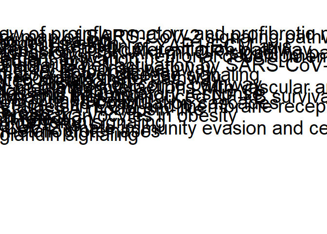

## Introduction

In this workflow, heatmap visualization for enriched pathways will be
performed.

## R environment setup

``` r
# check if libraries are already installed > otherwise install it
if (!requireNamespace("BiocManager", quietly = TRUE)) install.packages("BiocManager")
if(!"rstudioapi" %in% installed.packages()) BiocManager::install("rstudioapi")
if(!"RColorBrewer" %in% installed.packages()) BiocManager::install("RColorBrewer")  
if(!"dplyr" %in% installed.packages()) BiocManager::install("dplyr")
if(!"pheatmap" %in% installed.packages()) BiocManager::install("pheatmap")

#loading installed libraries
library(RColorBrewer) 
library(dplyr) 
library (pheatmap)

# set your working environment to the location where your current source file is saved into.
setwd(dirname(rstudioapi::getSourceEditorContext()$path))
```

## Importing dataset

Enriched pathway list will be imported.

``` r
##Obtain data from step 3:
setwd('..')
work_DIR <- getwd()
#we have four datasets in total
#read all pathway lists
CD.ileum <- read.delim("4-pathway_analysis/output/enrichResults_ORA_CD_ileum",sep = "\t", header = TRUE)
CD.rectum <- read.delim("4-pathway_analysis/output/enrichResults_ORA_CD_rectum", sep = "\t",header = TRUE)
UC.ileum <- read.delim("4-pathway_analysis/output/enrichResults_ORA_UC_ileum",sep = "\t", header = TRUE)
UC.rectum <- read.delim("4-pathway_analysis/output/enrichResults_ORA_UC_rectum", sep = "\t",header = TRUE)

# Set Working Directory back to current folder
setwd(dirname(rstudioapi::getSourceEditorContext()$path))
work_DIR <- getwd()

#we need to get pathways that has p.adjust value lower than 0.05 and qvalue<0.02
#To prevent high false discovery rate (FDR) in multiple testing, q-values are also estimated for FDR control.
CD.ileum.f <- CD.ileum[(CD.ileum$p.adjust<0.05)&(CD.ileum$qvalue<0.02),]
CD.rectum.f <- CD.rectum[(CD.rectum$p.adjust<0.05)&(CD.rectum$qvalue<0.02),]
UC.ileum.f <- UC.ileum[(UC.ileum$p.adjust<0.05)&(UC.ileum$qvalue<0.02),]
UC.rectum.f <- UC.rectum[(UC.rectum$p.adjust<0.05)&(UC.rectum$qvalue<0.02),]
```

## Merge all pathways into a pathway data frame

``` r
#Filter out unused columns 
CD.ileum.f  <- CD.ileum.f [,c(2,6)]
CD.rectum.f <- CD.rectum.f [,c(2,6)]
UC.ileum.f  <- UC.ileum.f [,c(2,6)]
UC.rectum.f <- UC.rectum.f [,c(2,6)]

#first 20 max value of p.adjust pathways for each comparison: Note that if a dataset has less then 20 sign. changed PWs, less rows need to be selected (e.g. adapt c(1:20))
#merge CD pathways
all.pathways.1 <- merge(CD.ileum.f[c(1:20),], CD.rectum.f[c(1:20),],by.x="Description", by.y="Description",sort = TRUE, all.x = TRUE, all.y = TRUE)
#merge UC pathways
all.pathways.2 <- merge(UC.ileum.f, UC.rectum.f[c(1:20),],by.x="Description", by.y="Description",sort = TRUE, all.x = TRUE, all.y = TRUE)
#merge all of them
all.pathways <- merge(all.pathways.1 , all.pathways.2 ,by.x="Description", by.y="Description",sort = TRUE, all.x = TRUE, all.y = TRUE)
colnames(all.pathways) <- c("Description","CD.ileum.p.adjust","CD.rectum.p.adjust","UC.ileum.p.adjust","UC.rectum.p.adjust")
#remove unused variables
rm(all.pathways.1, all.pathways.2)
```

## Modify merged pathway list

``` r
#replace NA values with the values from the whole list
#### for CD ileum
#find pathways which does not occur in the filtered enriched pathway list of cd.ileum (p.adjust<0.05 & qvalue<0.02 )
#because we will not take into account not sig. enriched pathways, we will assign value of 1 for their p.adjust
notExist.CDileum <- setdiff(all.pathways$Description,CD.ileum.f$Description)
all.pathways[all.pathways$Description %in% notExist.CDileum,]$CD.ileum.p.adjust <- 1

#the rest NA values correspond to the sig.enriched pathways but not in the first 20 list.
#so we will replace NA values with the p.adjust values from the whole list
NA.indices <- which(is.na(all.pathways$CD.ileum.p.adjust), arr.ind = TRUE)
allIDs <- all.pathways[NA.indices,]$Description
df <- CD.ileum.f[CD.ileum.f$Description %in% allIDs,]
df <- df[order(df$Description),]
all.pathways[all.pathways$Description %in% df$Description,]$CD.ileum.p.adjust <- df$p.adjust

#### for CD rectum
#find pathways which does not occur in the filtered enriched pathway list of cd rectum (p.adjust<0.05 & qvalue<0.02 )
notExist.CDrectum<- setdiff(all.pathways$Description,CD.rectum.f$Description)
all.pathways[all.pathways$Description %in% notExist.CDrectum,]$CD.rectum.p.adjust <- 1

#replacing NA values with the values from the whole list
NA.indices <- which(is.na(all.pathways$CD.rectum.p.adjust), arr.ind = TRUE)
allIDs <- all.pathways[NA.indices,]$Description
df <- CD.rectum.f[CD.rectum.f$Description %in% allIDs,]
df <- df[order(df$Description),]
all.pathways[all.pathways$Description %in% df$Description,]$CD.rectum.p.adjust <- df$p.adjust

#### for UC ileum
#find pathways which does not occur in the filtered enriched pathway list of UC ileum (p.adjust<0.05 & qvalue<0.02 )
notExist.UCileum <- setdiff(all.pathways$Description,UC.ileum.f$Description)
all.pathways[all.pathways$Description %in% notExist.UCileum,]$UC.ileum.p.adjust <- 1

#### for UC rectum
#find pathways which does not occur in the filtered enriched pathway list of UC rectum (p.adjust<0.05 & qvalue<0.02 )
notExist.UCrectum<- setdiff(all.pathways$Description,UC.rectum.f$Description)
all.pathways[all.pathways$Description %in% notExist.UCrectum,]$UC.rectum.p.adjust <- 1

#replacing NA values with the values from the whole list
NA.indices <- which(is.na(all.pathways$UC.rectum.p.adjust), arr.ind = TRUE)
allIDs <- all.pathways[NA.indices,]$Description
df <- UC.rectum.f[UC.rectum.f$Description %in% allIDs,]
df <- df[order(df$Description),]
all.pathways[all.pathways$Description %in% df$Description,]$UC.rectum.p.adjust <- df$p.adjust
```

## Heatmap visualization

``` r
#take only required columns
row.names(all.pathways) <- all.pathways$Description
all.pathways  <- all.pathways[,2:5]
colnames(all.pathways) <- c("CD.ileum","CD.rectum","UC.ileum","UC.rectum")

#create output folder if not exist
if(!dir.exists("output")) dir.create("output")

## Select a size to visualize the heatmap with (options; large or small)
size_heatmap <- "small"

##Print labels large for paper, small for notebook:
fontsize_row_l = 30 
if (size_heatmap == "large") {
fontsize_col_l = 30 
fontsize_l = 30
width_l =2000 
height_l =2000 
name_heatmap_file <- "output/heatmap_log10_large.png"
}else if(size_heatmap == "small"){ 
fontsize_row_l = 10 
fontsize_col_l = 10 
width_l =1500 
height_l =1500 
fontsize_l = 10
name_heatmap_file <- "output/heatmap_log10_small.png"
}else{print("Size not Recognised")}

#normally darker value represent higher values light color represent smaller values
#when we use rev function higher ones are represented by light color
colMain <- colorRampPalette(rev(brewer.pal(9, "Blues")))(30)

my_heatmap <- pheatmap(as.matrix(log10(all.pathways)), scale = "none", color = colMain , 
                       legend = TRUE , legend_breaks = c(0, -5, -10, -15, min(log10(all.pathways))), 
                       main = "", 
                       legend_labels = c("adj. p-values \n", " -5", " -10", " -15", ""),
                       cellwidth = 80, treeheight_row = 200, fontsize = fontsize_l, fontsize_row= fontsize_row_l, 
                       fontsize_col = fontsize_col_l, cluster_rows = TRUE, cluster_cols = FALSE)
```



``` r
#save obtained heatmap
save_pheatmap_png <- function(x, filename, width = width_l, height = height_l) {
  png(filename, width = width, height = height)
  grid::grid.newpage()
  grid::grid.draw(x$gtable)
  dev.off()
}
##p-values are visalized on a log10 scale, to make them more discriminatory.
save_pheatmap_png(my_heatmap, name_heatmap_file)
```

    ## png 
    ##   2

##Print session info and remove large datasets:

``` r
##Print session info:
sessionInfo()
```

    ## R version 4.2.0 (2022-04-22)
    ## Platform: x86_64-pc-linux-gnu (64-bit)
    ## Running under: Ubuntu 18.04.6 LTS
    ## 
    ## Matrix products: default
    ## BLAS:   /usr/lib/x86_64-linux-gnu/blas/libblas.so.3.7.1
    ## LAPACK: /usr/lib/x86_64-linux-gnu/lapack/liblapack.so.3.7.1
    ## 
    ## locale:
    ##  [1] LC_CTYPE=en_US.UTF-8       LC_NUMERIC=C              
    ##  [3] LC_TIME=nl_NL.UTF-8        LC_COLLATE=en_US.UTF-8    
    ##  [5] LC_MONETARY=nl_NL.UTF-8    LC_MESSAGES=en_US.UTF-8   
    ##  [7] LC_PAPER=nl_NL.UTF-8       LC_NAME=C                 
    ##  [9] LC_ADDRESS=C               LC_TELEPHONE=C            
    ## [11] LC_MEASUREMENT=nl_NL.UTF-8 LC_IDENTIFICATION=C       
    ## 
    ## attached base packages:
    ## [1] stats     graphics  grDevices utils     datasets  methods   base     
    ## 
    ## other attached packages:
    ## [1] pheatmap_1.0.12    dplyr_1.0.9        RColorBrewer_1.1-3
    ## 
    ## loaded via a namespace (and not attached):
    ##  [1] highr_0.9           pillar_1.7.0        compiler_4.2.0     
    ##  [4] BiocManager_1.30.17 tools_4.2.0         digest_0.6.29      
    ##  [7] evaluate_0.15       lifecycle_1.0.1     tibble_3.1.7       
    ## [10] gtable_0.3.0        pkgconfig_2.0.3     rlang_1.0.2        
    ## [13] cli_3.3.0           DBI_1.1.2           rstudioapi_0.13    
    ## [16] yaml_2.3.5          xfun_0.31           fastmap_1.1.0      
    ## [19] stringr_1.4.0       knitr_1.39          generics_0.1.2     
    ## [22] vctrs_0.4.1         grid_4.2.0          tidyselect_1.1.2   
    ## [25] glue_1.6.2          R6_2.5.1            fansi_1.0.3        
    ## [28] rmarkdown_2.14      purrr_0.3.4         magrittr_2.0.3     
    ## [31] scales_1.2.0        ellipsis_0.3.2      htmltools_0.5.2    
    ## [34] assertthat_0.2.1    colorspace_2.0-3    utf8_1.2.2         
    ## [37] stringi_1.7.6       munsell_0.5.0       crayon_1.5.1

``` r
##Remove data objects which are not needed for further processing:
rm(list=setdiff(ls(), "all.pathways"))
```

## Last, we create a Jupyter notebook from this script

``` r
#Jupyter Notebook file
if(!"devtools" %in% installed.packages()) BiocManager::install("devtools")
devtools::install_github("mkearney/rmd2jupyter", force=TRUE)
```

    ## 
    ## * checking for file ‘/tmp/RtmpfrNVPL/remotes6e282b26e5e7/mkearney-rmd2jupyter-d2bd2aa/DESCRIPTION’ ... OK
    ## * preparing ‘rmd2jupyter’:
    ## * checking DESCRIPTION meta-information ... OK
    ## * checking for LF line-endings in source and make files and shell scripts
    ## * checking for empty or unneeded directories
    ## Omitted ‘LazyData’ from DESCRIPTION
    ## * building ‘rmd2jupyter_0.1.0.tar.gz’

``` r
library(devtools)
library(rmd2jupyter)
setwd(dirname(rstudioapi::getSourceEditorContext()$path))
rmd2jupyter("heatMap.Rmd")
```
